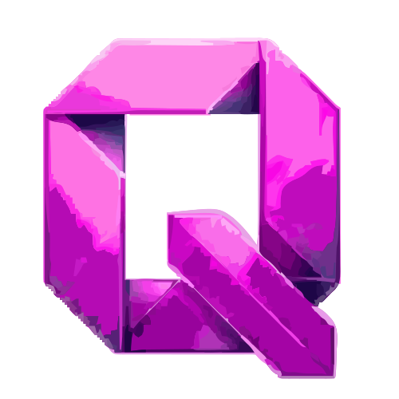

<div align="center">
  

  <h1>Qnsult</h1>

  <p><strong>AI-native consulting relationship intelligence — built for the Google Cloud Rapid Agent Hackathon</strong></p>

  <p>
    <a href="https://qnsult-531967246658.us-central1.run.app"><strong>Live App</strong></a> ·
    <a href="https://qnsult-adk-531967246658.us-central1.run.app/docs"><strong>ADK API Docs</strong></a> ·
    <a href="#local-setup">Run locally</a>
  </p>

  
</div>

---

## What is Qnsult?

Qnsult is an autonomous intelligence layer for consulting firms. It monitors every client relationship across your portfolio in real time — reading your Gmail, Calendar, and meeting notes — and surfaces who's at risk, what to do next, and when to act.

The core insight is a **two-axis portfolio map**:

- **Y-axis — Value Chain Position (1–10):** Are you doing execution work (AI-replaceable, low-margin) or embedded strategic advisory (AI-resistant, high retention)?
- **X-axis — Relationship Health (1–10):** Is this a transactional engagement or a multi-stakeholder embedded partnership?

Every account moves toward the top-right or drifts toward the bottom-left. Qnsult tells you which direction each client is heading, why, and what to do about it — before it's too late.

---

## Key Features

| Feature | Description |
|---|---|
| **Portfolio Intelligence** | Live 2D scatter map with composite momentum scores for all clients |
| **Stall Detection** | Detects executive silence, billing gaps, and missed milestones before they compound |
| **Competitive Risk** | Scans inboxes for RFP signals, talent poaching, and competitor shadow proposals |
| **AI Danger Zone** | Measures each deliverable's AI displacement exposure (0–100%) |
| **Outreach Drafting** | Agent auto-drafts recovery, expansion, and renewal emails for your approval |
| **Portfolio Chat** | Conversational AI that answers questions about your portfolio using live data |
| **Real-time Actions** | Supabase Realtime push to dashboard as agents complete each client |
| **Pattern Library** | Stores what worked (Executive Bridge, Stakeholder Anchor, Scope Lock) and reapplies it |

---

## Architecture

```
Gmail / Google Calendar
        │
        ▼
┌─────────────────────────────────────────────────────────┐
│  ADK Backend  (Python · Google ADK 2.2 · Gemini 2.5 Flash) │
│                                                         │
│  Ingestion Layer           Analysis Layer               │
│  ├── AG-01  gmail_signal   ├── AG-04  stall_detection   │
│  ├── AG-02  calendar_tracker├── AG-05  exec_mapper      │
│  └── AG-03  meeting_intel  ├── AG-06  value_chain       │
│                            ├── AG-07  goal_alignment    │
│  Synthesis Layer           ├── AG-08  renewal_risk      │
│  ├── AG-09  competitive_signal├── AG-10  expansion_ops  │
│  └── AG-11  pattern_library│                            │
│                            Action Layer                 │
│  Orchestrator              └── AG-12b outreach_drafter  │
│  └── AG-12  momentum_agent (root agent)                 │
│             └── portfolio_chat_agent (conversational)   │
│                                                         │
│  Data reads via MongoDB MCP server (npm binary, ~1s/call)│
└──────────────────┬──────────────────────────────────────┘
                   │ writes
        ┌──────────┴──────────┐
        ▼                     ▼
  MongoDB Atlas          Supabase (Postgres)
  consultiq db           user data + realtime
  (agent signals,        (action_items,
   scores, history)       gmail_threads,
                          dashboard_queue)
        │                     │
        └──────────┬──────────┘
                   │ reads
                   ▼
┌─────────────────────────────────────────────────────────┐
│  Next.js Frontend  (TypeScript · Tailwind · App Router) │
│  ├── /api/*  →  MongoDB Atlas  (agent pipeline data)    │
│  └── Supabase JS  →  Supabase  (user data + realtime)   │
└─────────────────────────────────────────────────────────┘
```

---

## The 12 Agents

| ID | Agent | Role |
|---|---|---|
| AG-01 | `gmail_signal` | Extracts relationship signals, sentiment, and exec engagement from Gmail |
| AG-02 | `calendar_tracker` | Maps meeting cadence, exec dark days, and upcoming touchpoints |
| AG-03 | `meeting_intel` | Pulls commitments and deliverables from meeting notes and Google Drive |
| AG-04 | `stall_detection` | Scores stall risk (0–10), detects exec silence patterns |
| AG-05 | `exec_mapper` | Quantifies executive accessibility and relationship depth |
| AG-06 | `value_chain` | Maps strategic whitespace and AI displacement exposure per deliverable |
| AG-07 | `goal_alignment` | Scores alignment between client goals and your service delivery |
| AG-08 | `renewal_risk` | Computes renewal probability using billing data, signals, and exec access |
| AG-09 | `competitive_signal` | Detects competitor RFP bids, talent poaching, and shadow proposals |
| AG-10 | `expansion_ops` | Builds expansion briefs when whitespace and timing align |
| AG-11 | `pattern_library` | Records successful playbooks and surfaces them for similar situations |
| AG-12 | `momentum_agent` | Root orchestrator — runs all agents, computes composite score, writes final output |

**Composite score formula (AG-12):**

```
composite = (relationship_score × 0.30)
          + (goal_alignment_score × 0.25)
          + ((10 − stall_score) × 0.20)
          + (cadence_trend_score + 1) × 0.75   # −1/0/1 → 0/0.75/1.5
          + (position_score / 10) × 1.0
```

Clamped 1.0–10.0. Bands: ≥ 8.0 Accelerating · ≥ 6.0 On Track · ≥ 4.0 Progressing · ≥ 2.0 At Risk · otherwise Stalling.

---

## Tech Stack

| Layer | Technology |
|---|---|
| Frontend | Next.js 15, TypeScript, Tailwind CSS, App Router |
| Agent runtime | Google ADK 2.2, Python 3.12, Gemini 2.5 Flash |
| Agent data store | MongoDB Atlas (`consultiq` database) |
| MCP server | `mongodb-mcp-server` npm binary (globally installed on Cloud Run, ~1s/call) |
| User data + realtime | Supabase (Postgres + Realtime subscriptions) |
| Auth | Supabase Auth with Google OAuth (Gmail + Calendar scopes) |
| Hosting | Google Cloud Run (two services: `qnsult` frontend, `qnsult-adk` backend) |
| Container | Docker (python:3.12-slim + Node.js for MCP binary) |

---

## Production Links

| Service | URL |
|---|---|
| Frontend (live app) | https://qnsult-531967246658.us-central1.run.app |
| ADK backend (API docs) | https://qnsult-adk-531967246658.us-central1.run.app/docs |
| ADK health check | https://qnsult-adk-531967246658.us-central1.run.app/health |

---

## Local Setup

### Prerequisites

- Node.js 18+
- Python 3.12+
- `npm install -g mongodb-mcp-server`
- A Google Cloud project with Gmail + Calendar APIs enabled
- MongoDB Atlas cluster
- Supabase project

### 1. Clone the repo

```bash
# Frontend (this repo — main branch)
git clone https://github.com/no-one-knows-gourav/qnsult.git
cd qnsult

# ADK backend (backend branch)
git clone -b backend https://github.com/no-one-knows-gourav/qnsult.git qnsult-adk
```

### 2. Frontend environment

Create `qnsult/.env.local`:

```env
NEXT_PUBLIC_SUPABASE_URL=https://<your-project>.supabase.co
NEXT_PUBLIC_SUPABASE_ANON_KEY=<anon-key>
SUPABASE_SERVICE_ROLE_KEY=<service-role-key>

GOOGLE_CLIENT_ID=<oauth-client-id>
GOOGLE_CLIENT_SECRET=<oauth-client-secret>

ADK_SERVER_URL=http://localhost:8000
```

### 3. ADK backend environment

Create `qnsult-adk/agents/.env`:

```env
SUPABASE_URL=https://<your-project>.supabase.co
SUPABASE_SERVICE_ROLE_KEY=<service-role-key>

MDB_MCP_CONNECTION_STRING=mongodb+srv://<user>:<pass>@cluster0.xxxxx.mongodb.net/consultiq
MDB_MCP_API_CLIENT_ID=<mongodb-atlas-api-client-id>
MDB_MCP_API_CLIENT_SECRET=<mongodb-atlas-api-client-secret>

GOOGLE_APPLICATION_CREDENTIALS=credentials.json
```

Place your `credentials.json` (OAuth Desktop client) and `token.json` (from the first OAuth run) in the `qnsult-adk/` directory.

### 4. Install dependencies

```bash
# Frontend
cd qnsult
npm install

# ADK backend
cd qnsult-adk
pip install -r requirements.txt
```

### 5. Run locally

**Terminal 1 — ADK backend:**

```bash
cd qnsult-adk
adk api_server agents --port 8000
```

**Terminal 2 — Next.js frontend:**

```bash
cd qnsult
npm run dev
```

Open [http://localhost:3000](http://localhost:3000).

### 6. Trigger the agent pipeline

From the dashboard, click **"Run Triage"** to scan all active clients, or navigate to a client and click **"Run Full Analysis"** to run the 12-agent pipeline for that account.

The pipeline writes results to MongoDB and mirrors user-facing data (action items, email drafts, agent notifications) to Supabase in real time.

---

## Repository Structure

```
qnsult/                          # Frontend (this repo, main branch)
├── app/
│   ├── api/
│   │   ├── portfolio-chat/      # Proxies to ADK portfolio_chat_agent
│   │   ├── run-analysis/        # Triggers triage or single-client analysis
│   │   └── pattern-deploy/      # Pattern Library API
│   └── dashboard/               # All dashboard tabs (Next.js App Router)
├── components/                  # Shared UI components
├── lib/                         # Supabase client, API helpers
└── public/                      # Logo, landing page assets

qnsult (backend branch)          # ADK backend
├── agents/
│   ├── ingestion/               # AG-01, AG-02, AG-03
│   ├── layer1/                  # AG-04 through AG-10
│   ├── action/                  # AG-12b outreach_drafter
│   ├── orchestrator/            # AG-12 momentum_agent, portfolio_chat
│   └── shared/                  # mongo_tools.py, supabase_tools.py
├── Dockerfile
├── requirements.txt
└── start.sh
```

---

## License

[MIT](LICENSE) · 
